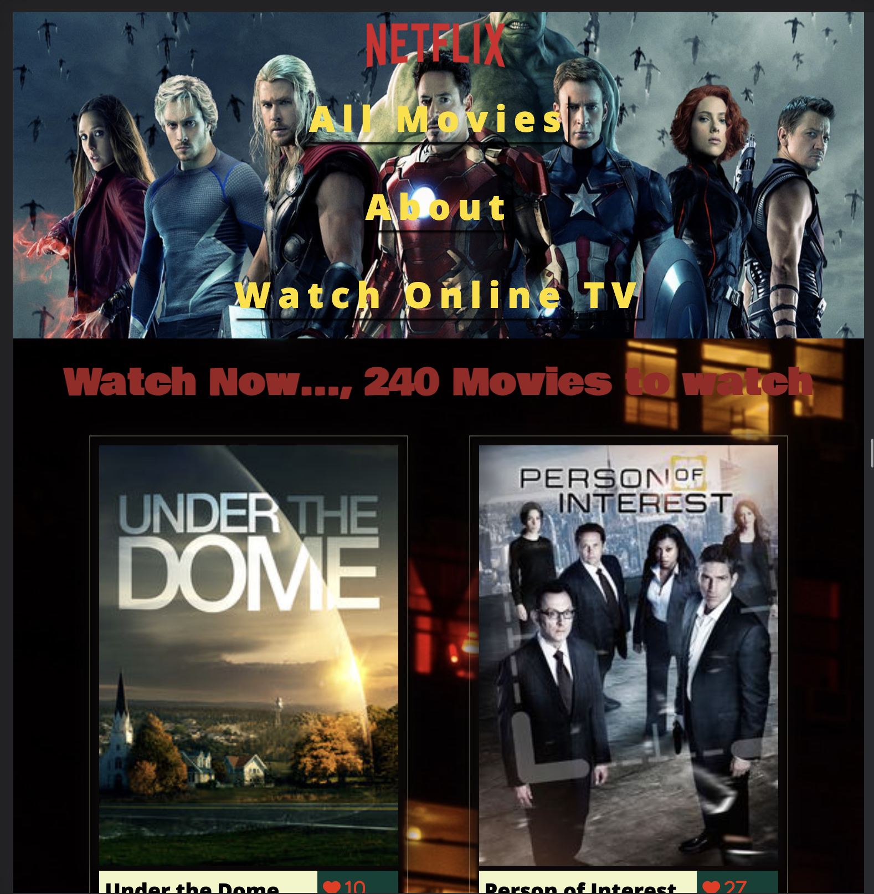
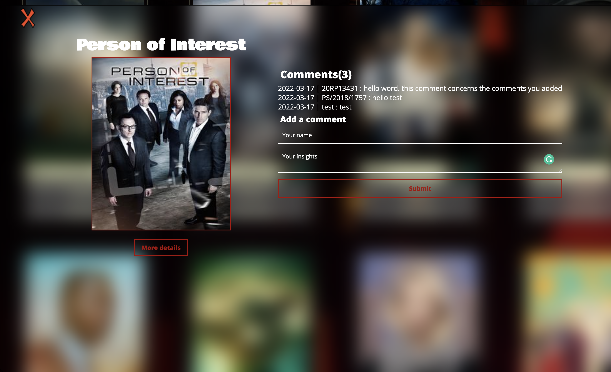
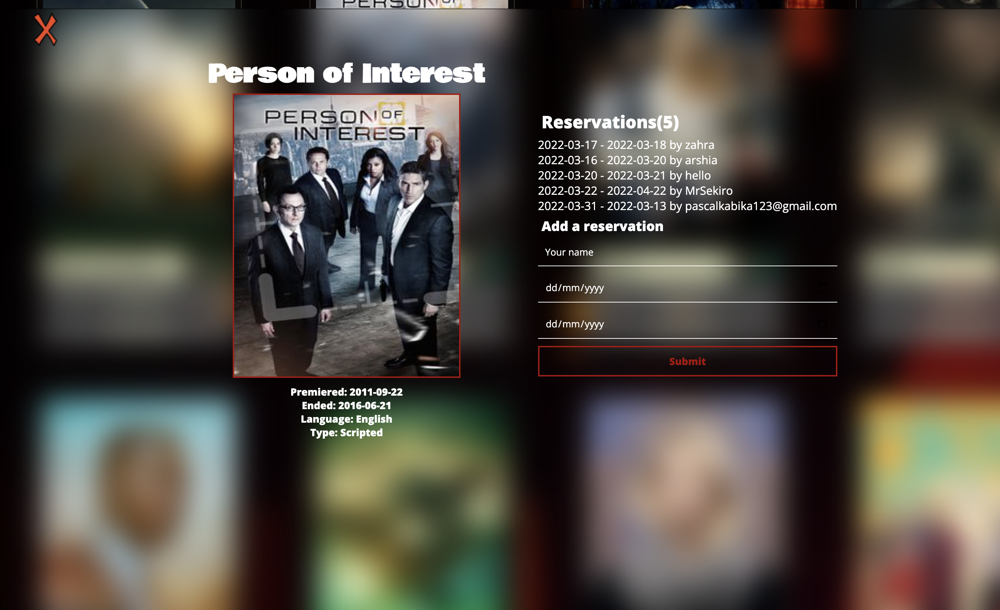

# TV series and movies

JavaScript capstone project - API-based webapp

> This is The JavaScript capstone project about building web application based on the external TVmaze API: data about TV series and movies.API with 2 user interfaces. Done in group of three persons.

## Screenshoots



### Comment poppup view



### Reservations poppup view



## Built With

- HTML
- CSS
- JavaScript
- Webpack
- Jest

## Live Demo

[live demo](https://tv-maize-zahra-pascal-samiullah-jscapstone.netlify.app/)

## Project Documentation

[Documentation](https://drive.google.com/file/d/11Ts_QPmm9nwgFE4hdCsyrHx01WBlB2uq/view?usp=sharing)

## Getting Started

Running the app localy:
```
git clone https://github.com/ZahraArshia/TV-series-and-movies.git 
```

### Prerequisites

clone repo using ssh key :
```
git@github.com:ZahraArshia/TV-series-and-movies.git
```

### Install

run `npm install` to install dependencies
```
npm install
npm run build
npm install --save-dev webpack-dev-server
npm start   
```

## Contribute

Contributions, issues, and feature requests are welcome!

Feel free to check the [issues page](https://github.com/ZahraArshia/TV-series-and-movies/issues)

## Authors

👤 **Zahra Arshia**

- GitHub: [Link](https://github.com/ZahraArshia)
- Twitter: [Twitter]()

👤 **Pascal Kabika**

- GitHub: [Link](https://github.com/KABIKA681)
- LinkedIn:[Link](https://www.linkedin.com/in/pascal-kabika-443061220/)

👤 **Samiullah Bahadur**

- GitHub: [Link](https://github.com/samiullahbahadur)
- Twitter: [Twitter]()

## Show your support

Give a ⭐️ if you like this project!


## Acknowledgements

The authors highly appreciate the help in the project from all the participants of this week's program for the timely response to all questions from our team.

## 📝 License

This project is [MIT](./MIT.md) licensed.
